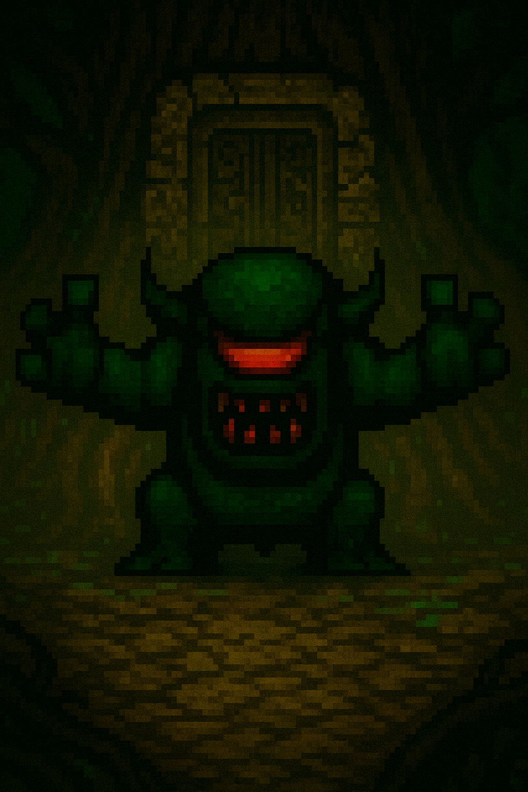

# The Wizard’s Trial  
A Story-Driven Fantasy Adventure

Welcome to **The Wizard’s Trial**, a handcrafted pixel-fantasy adventure where spellcasting, lore, and classic 16-bit storytelling collide.  
You play as **The Apprentice**, a rising young wizard who steps into a corrupted world ruled by ancient titans and forgotten sages.

Your journey begins in the depths of the **Withering Forest**…  
and what you uncover there will define your destiny.

---

## Features

### • Narrative-Rich World  
Explore a fully realized universe of corrupted sanctums, ancient temples, elemental sages, and a deep mythology waiting to be unearthed.

### • 16-Bit Inspired Art Direction  
Hand-crafted pixel characters, cinematic cutscenes, and parallax environments inspired by SNES-era golden-age fantasy.

### • Hybrid Combat & Puzzle Gameplay  
Engage in action combat, environmental spell puzzles, movement-driven challenges, and boss-focused progression.

### • Dynamic Spellcasting System  
Master elemental magic—fire, ice, storm, earth, and arcane—each with unique combat interactions and puzzle utilities.

### • Cinematic Boss Encounters  
Each region ends with a titan who tests your timing, awareness, spell discipline, and adaptability.

---

# The Withering Forest — Opening Chapter Preview  
Below are the cinematic scenes from the first chapter.

### Scene 1 — The Withering Begins  
*The forest decays. Shadows coil. Magic falters.*  

### Scene 2 — Echoes of the Fallen Woods  
*Ancient runes stir. Something colossal watches from below.*  

### Scene 3 — The Chamber of Bohban  
*Stone splits. Roots twist. Bohban awakens.*  

### Scene 4 — Bohban’s Wrath  
*Corruption surges. The sanctum shakes.*  

### Scene 5 — The Sage of Earth Appears  
*Green holy fire erupts. A guardian returns.*  

---

## Core Systems Breakdown

### Spellcasting Engine  
Each spell includes:  
- Base effect  
- Secondary effect  
- Combat synergy  
- Puzzle integration  
- Boss-specific utility  

### Combat Flow  
- Timing-based spellcasting  
- Pattern-driven enemy encounters  
- Dodging, movement, and mana control  
- High-impact boss battles  

### Environmental Design  
- Layered parallax environments  
- Region-specific palettes  
- Hidden lore touchpoints  
- Atmospheric transitions  

---

## Development Roadmap

| Phase | Status | Notes |
|-------|--------|--------|
| Concept Art | Complete | Withering Forest established |
| Spell Engine | In Progress | Core spells implemented |
| Boss System | In Progress | Bohban encounter functional |
| Level Design | Expanding | Adding new biomes |
| OST | Early Development | World selection theme finished |
| Cutscenes | Ongoing | 16-bit vertical cinematic pipeline |

---

## Tech Stack

- **Swift / Xcode**
- **SpriteKit**
- **Custom animation workflows**
- **Layered parallax system**
- **Hand-drawn pixel art assets**

---

## About the Developer

**The Wizard’s Trial** is built by **Roberto Borges**, a solo developer blending classic fantasy storytelling with modern gameplay, pixel art, and atmospheric world-building.

Follow development on Instagram: **@christpilleddomain**

---

## License

This project and all included assets are © Roberto Borges.  
Unauthorized use, redistribution, or modification is not permitted.

